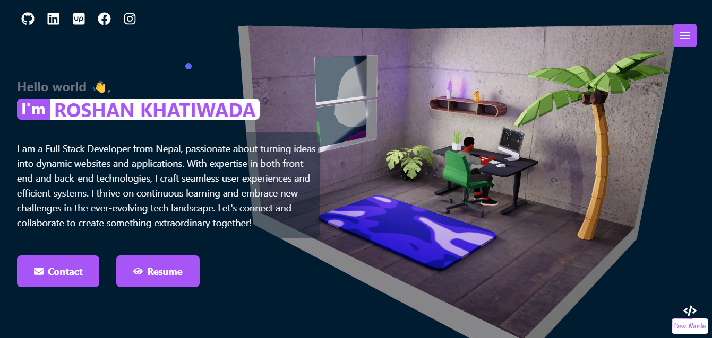

# 🚀 Roshan Khatiwada - Portfolio



Welcome to my interactive 3D portfolio! This is a modern, immersive web experience showcasing my skills as a Full Stack Developer.

## ✨ Features

- **3D Interactive Environment**: Built with Three.js and React Three Fiber
- **Smooth Animations**: Powered by Framer Motion for fluid transitions
- **Responsive Design**: Optimized for all device sizes
- **Interactive Elements**: Command prompt interface and dynamic icon cloud
- **Modern UI/UX**: Clean, professional design with Tailwind CSS

## 🛠️ Tech Stack

### Frontend
- **React 18** - Modern UI library
- **Vite** - Fast build tool and development server
- **Three.js** - 3D graphics library
- **React Three Fiber** - React renderer for Three.js
- **React Three Drei** - Useful helpers for React Three Fiber
- **Framer Motion** - Animation library
- **Tailwind CSS** - Utility-first CSS framework

### 3D Assets & Animation
- **Blender** - 3D scene modeling and baking
- **Ready Player Me** - Avatar creation
- **Mixamo** - Character animations
- **React Icon Cloud** - Dynamic skill visualization

### Deployment
- **Vercel** - Hosting platform

## 🎯 Key Sections

1. **About** - Personal introduction and background
2. **Skills** - Interactive 3D icon cloud showcasing technologies
3. **Projects** - Portfolio of completed work
4. **Contact** - Get in touch form

## 🚀 Getting Started

### Prerequisites
- Node.js (v16 or higher)
- npm or yarn

### Installation

1. Clone the repository:
```bash
git clone https://github.com/Roshan-Khatiwada/Portfolio-me-3D.git
cd Portfolio-me-3D
```

2. Install dependencies:
```bash
npm install
# or
yarn install
```

3. Start the development server:
```bash
npm run dev
# or
yarn dev
```

4. Open your browser and visit `http://localhost:5173`

## 📁 Project Structure

```
src/
├── components/
│   ├── developerContent/     # Command prompt interface components
│   ├── icons/               # Custom icon components
│   ├── Avatar.jsx           # 3D avatar component
│   ├── Background.jsx       # 3D background scene
│   ├── DynamicIconCloud.jsx # Interactive skill icons
│   ├── Interface.jsx        # Main UI components
│   └── ...
├── assets/                  # Static assets
├── config.js               # Application configuration
└── main.jsx               # Application entry point
```

## 🎨 Customization

- **Colors**: Modify the color scheme in `tailwind.config.js`
- **3D Models**: Replace models in `public/models/`
- **Content**: Update personal information in component files
- **Projects**: Add/remove projects in the Projects component

## 🌐 Live Demo

Visit the live portfolio: [https://roshankhatiwada.vercel.app/](https://roshankhatiwada.vercel.app/)

## 📧 Contact

- **Email**: [Your Email]
- **LinkedIn**: [Your LinkedIn]
- **GitHub**: [Your GitHub]

## 📄 License

This project is open source and available under the [MIT License](LICENSE).

---

⭐ If you found this portfolio helpful, please give it a star!

